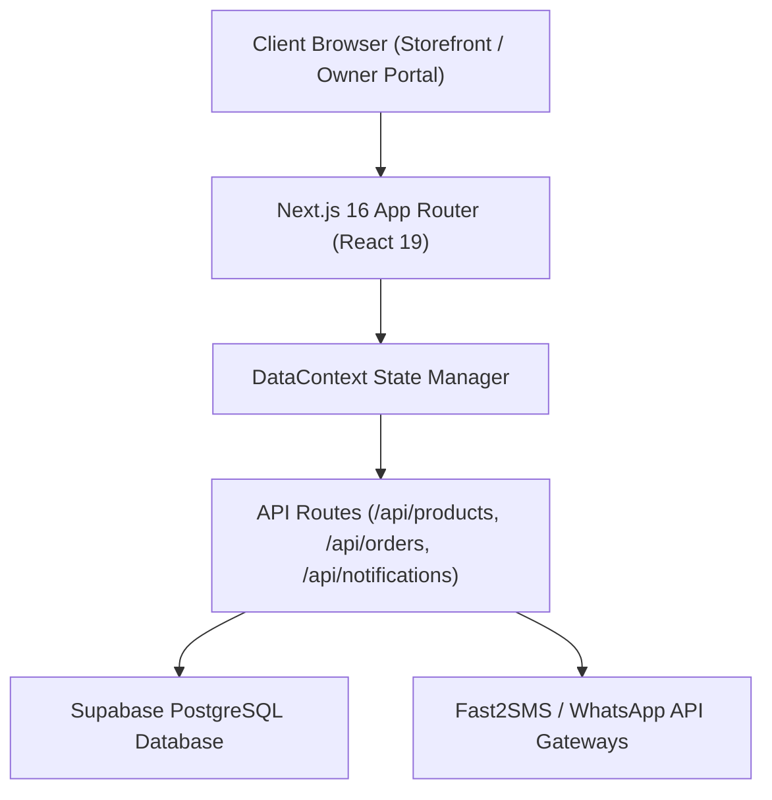

# Shop Management & Online Ordering System

A full-stack, real-time web application built with **Next.js 16 (App Router)**, **TypeScript**, **Tailwind CSS v4**, and **Supabase (PostgreSQL)**. Designed specifically for retail shop owners (e.g., local supermarkets, tea stalls, grocery stores) to handle online customer ordering, in-store Point of Sale (POS) billing, inventory tracking, stock movements, and financial profit analytics.

---

## 1. Project Overview
The **Shop Management & Online Ordering System** bridges the gap between traditional brick-and-mortar retail counters and modern digital storefronts. It provides two integrated experiences:
1. **Customer Storefront**: Allows local customers to browse real-time shop inventory, filter by category, add items to cart, select home delivery or shop pickup, pay via Cash or UPI, and track order status with digital invoice receipts.
2. **Owner Management Portal**: A secure command center for the shop administrator to manage products, execute POS counter billing (`INV-XXXX`), audit stock movements, handle incoming orders, dispatch digital bills via SMS/WhatsApp, and analyze profit metrics (Gross Profit, Net Profit, Expenses, and Capital Investments).

---

## 2. Problem Statement
Small-to-medium neighborhood retail businesses face several operational bottlenecks:
- **Manual Bookkeeping**: Paper-based receipts lead to calculation errors, misplaced records, and unclear profit margins.
- **Inventory Discrepancies**: Stock levels are difficult to track manually, leading to stockouts or over-purchasing.
- **Fragmented Sales Channels**: In-store sales and online phone orders are managed separately, creating confusion in inventory.
- **Lack of Financial Visibility**: Business owners struggle to compute true Net Profit after deducting Cost of Goods Sold (COGS) and operational overheads (rent, electricity, salaries).

---

## 3. Proposed Solution
This system unifies customer online ordering and in-store POS billing into a single database schema. Every sale—whether placed online by a customer or billed at the counter by the owner—instantly updates the central database stock, generates a digital invoice token, records stock movement audit trails, and updates real-time financial dashboards.

---

## 4. Key Features
- **Real-Time Database Synchronization**: Powered by Supabase PostgreSQL with local-storage fallback for offline resilience.
- **Dual-Role Architecture**: Dedicated Customer Storefront and Owner Admin Portal.
- **Automated Digital Invoicing**: Instant PDF & PNG printable receipts accessible at `/invoice/[token]`.
- **SMS & WhatsApp Integration**: Direct 1-click dispatch of itemized digital receipts via Fast2SMS & WhatsApp Web API.
- **Live Stock Lifecycle & Audit Trail**: Automatic stock deduction on purchase, stock restoration on order cancellation, and low-stock alerts.
- **Financial Analytics**: Recharts visualization of Sales vs Profit trends, COGS breakdown, and expense tracking.

---

## 5. Customer Features
- **Product Catalog Browsing**: Search by name, brand, or category with instant stock badges ("In Stock", "Low Stock", "Out of Stock").
- **Cart & Boundary Validation**: Quantity selection strictly constrained by current database inventory.
- **Express Checkout**: Select Home Delivery (with address validation) or Shop Pickup.
- **Multiple Payment Options**: Cash on Delivery (COD) or instant UPI QR scanner (GPay, PhonePe, Paytm).
- **Order Tracking & History**: Track order status (`Pending` $\rightarrow$ `Confirmed` $\rightarrow$ `Preparing` $\rightarrow$ `Ready` $\rightarrow$ `Out for Delivery` $\rightarrow$ `Delivered`).
- **Customer Account Portal**: Save default delivery addresses and view past order history.

---

## 6. Owner Features
- **Dashboard Command Center**: Real-time KPI cards for Total Sales, Total Orders, Total Expenses, Investments, Gross Profit, Net Profit, and Low Stock Alerts.
- **Product Management**: Full CRUD operations with validation (prevent negative prices/stock).
- **Stock Matrix & Restock**: Fast 1-click restock buttons (`+5`, `+10`, `Custom`) and complete `stock_movements` log.
- **POS Billing Terminal**: Quick search and tap-to-bill interface for in-store sales (`INV-XXXX`).
- **Sales Analytics**: Interactive charts for Daily, Weekly, and Monthly sales distributions.
- **Expense & Investment Logs**: Track operational costs (Rent, Electricity, Transport, Salaries) and capital investments.
- **Profit Analytics**: Automated calculation of Gross Profit ($Revenue - COGS$) and Net Profit ($Gross Profit - Expenses$).
- **Shop Settings**: Update store branding, UPI ID, QR Code URL, opening hours, and Google Maps location.

---

## 7. System Architecture



---

## 8. Technology Stack
- **Framework**: Next.js 16 (App Router)
- **UI Library**: React 19 & Lucide React Icons
- **Language**: TypeScript
- **Styling**: Tailwind CSS v4 & Vanilla CSS
- **Database & Backend**: Supabase & PostgreSQL
- **Data Visualization**: Recharts
- **Image Generation / Export**: html2canvas

---

## 9. Database Structure

The database schema (`supabase/schema.sql`) contains 10 core tables:

| Table Name | Description | Key Fields |
|---|---|---|
| `shop` | Store settings & branding | `id`, `name`, `address`, `phone`, `email`, `upi_id`, `qr_code_url`, `google_maps_url` |
| `categories` | Product categories | `id`, `name`, `image_url` |
| `products` | Product inventory | `id`, `name`, `category_id`, `purchase_price`, `selling_price`, `stock_quantity`, `low_stock_limit` |
| `orders` | Customer online orders | `id`, `order_number`, `customer_name`, `customer_phone`, `total_amount`, `payment_method`, `order_status` |
| `order_items` | Line items for orders | `id`, `order_id`, `product_id`, `product_name`, `quantity`, `selling_price`, `subtotal` |
| `bills` | POS counter bills | `id`, `bill_number`, `customer_name`, `customer_phone`, `total`, `payment_method`, `invoice_token` |
| `bill_items` | Line items for POS bills | `id`, `bill_id`, `product_id`, `product_name`, `quantity`, `selling_price`, `subtotal` |
| `expenses` | Shop operating costs | `id`, `title`, `category`, `amount`, `date`, `notes` |
| `investments` | Capital investments | `id`, `title`, `category`, `amount`, `date`, `notes` |
| `stock_movements`| Audit log of stock changes | `id`, `product_id`, `product_name`, `quantity`, `movement_type`, `reference_id` |

---

## 10. Authentication
- **Customer Authentication**: Account registration and login managed via `DataContext` and stored securely.
- **Owner Authentication**: Protected owner layout and server-side HTTP `owner_auth` cookie validation on mutating API routes (`POST /api/products`, `DELETE /api/products`, `PUT /api/orders`).

---

## 11. API Structure
- `GET /api/products`: Fetches all store products from Supabase / cloud memory.
- `POST /api/products`: Create or update product (Owner Authorized).
- `DELETE /api/products?id={id}`: Deletes product (Owner Authorized).
- `GET /api/orders`: Retrieves online orders & POS bills.
- `POST /api/orders`: Creates new online customer order or POS bill.
- `PUT /api/orders`: Updates order status (Owner Authorized).
- `POST /api/notifications/send-bill`: Dispatches digital receipt link to customer mobile.

---

## 12. Installation

1. **Clone the Repository**:
   ```bash
   git clone https://github.com/kenny-002/shop-management-online-ordering.git
   cd shop-management-online-ordering
   ```

2. **Install Dependencies**:
   ```bash
   npm install
   ```

---

## 13. Environment Variables

Create a `.env.local` file in the root directory:

```env
# Supabase PostgreSQL Configuration
NEXT_PUBLIC_SUPABASE_URL=https://your-supabase-project.supabase.co
NEXT_PUBLIC_SUPABASE_ANON_KEY=your-supabase-anon-key-here

# SMS Gateway (Fast2SMS India)
NEXT_PUBLIC_FAST2SMS_API_KEY=your-fast2sms-key-here

# WhatsApp Business API (Optional)
NEXT_PUBLIC_WHATSAPP_API_KEY=your-whatsapp-key-here
```

---

## 14. Supabase Setup

1. Create a new project in [Supabase Dashboard](https://supabase.com).
2. Open the **SQL Editor** in your Supabase dashboard.
3. Run `supabase/schema.sql` to construct all 10 tables and constraints.
4. Run `supabase/seed.sql` to populate sample categories, products, expenses, and investments.

---

## 15. Running the Project

Run the Next.js development server:
```bash
npm run dev
```
Open [http://localhost:3000](http://localhost:3000) in your browser.

---

## 16. Screenshots

| Store Front Display | Counter Display |
|---|---|
|  |  |

| Store Interior | Biscuits & Snacks |
|---|---|
|  |  |

---

## 17. Project Folder Structure

```
src/
├── app/
│   ├── (storefront)/
│   │   ├── account/          # Customer Account & Delivery Addresses
│   │   ├── cart/             # Shopping Cart & Quantity Controls
│   │   ├── checkout/         # Shipping & Payment Selection (COD / UPI)
│   │   ├── login/            # Customer Portal Authentication
│   │   ├── my-orders/        # Customer Order History & Invoice Links
│   │   ├── orders/           # Order Tracking Confirmation Pages
│   │   ├── products/         # Catalog Search & Category Filter
│   │   └── page.tsx          # Storefront Landing Page
│   │
│   ├── api/
│   │   ├── notifications/    # Fast2SMS & WhatsApp Dispatch APIs
│   │   ├── orders/           # Order & Bill Management APIs
│   │   └── products/         # Product Inventory APIs
│   │
│   ├── invoice/[token]/      # Printable Digital Invoice Generator
│   └── owner/
│       ├── billing/          # POS Billing Terminal & Receipt Generator
│       ├── dashboard/        # Live Analytics & Key Performance Metrics
│       ├── expenses/         # Operating Overhead Expense Tracking
│       ├── investments/      # Capital & Equipment Investment Logs
│       ├── login/            # Secure Owner Login
│       ├── orders/           # Order Processing & Status Updates
│       ├── products/         # Inventory Management (Add/Edit/Delete)
│       ├── profit/           # Gross & Net Profit Margin Analytics
│       ├── sales/            # Sales Trends & Category Distribution
│       ├── settings/         # Store Options & Google Maps Config
│       └── stock/            # Stock Matrix & Movement Audit Trail
│
├── context/
│   └── data-context.tsx      # Main Data Provider & Business Logic State
│
└── lib/
    ├── sms-service.ts        # SMS & WhatsApp Gateway Helper Services
    ├── supabase.ts           # Supabase Client & Database CRUD Helpers
    └── types.ts              # TypeScript Interfaces & Types

supabase/
├── schema.sql                # PostgreSQL Database Schema Script
└── seed.sql                  # Initial Database Seed Data Script
```

---

## 18. Future Enhancements
- **Multi-Branch Support**: Ability to manage multiple shop outlets under one owner dashboard.
- **Barcode Scanner Integration**: WebCam or Hardware USB barcode scanner support for the POS terminal.
- **Dark / Light Theme Toggle**: User-selectable theme modes for customer storefront.

---

## 19. Testing

Run TypeScript validation:
```bash
npx tsc --noEmit
```

Run ESLint code quality checks:
```bash
npx eslint .
```

Build production distribution:
```bash
npm run build
```

---

## 20. Contributors
Developed for **Shop Management & Online Ordering System** College Evaluation Project.
- **Tech Lead & Developer**: Dinesh S (`dinesh2122007@gmail.com`)
